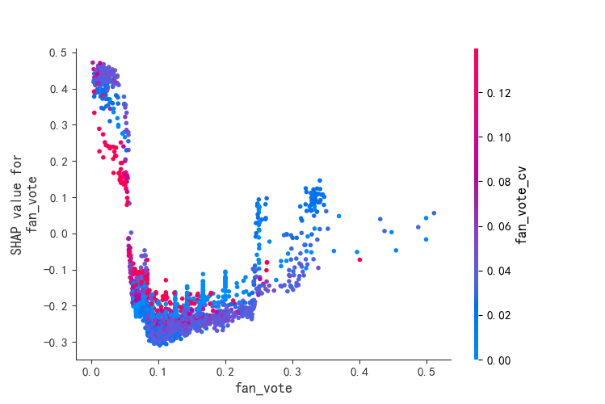
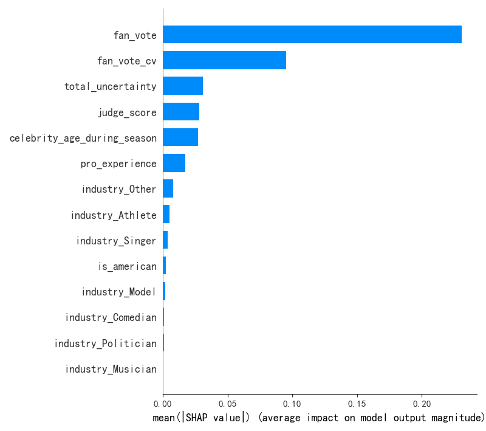
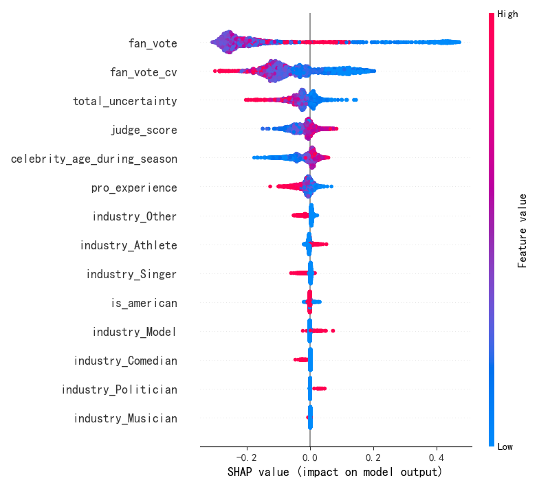
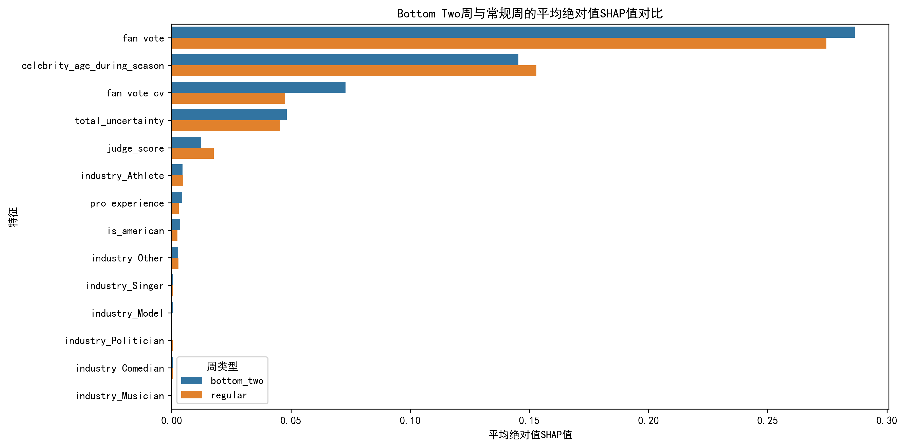

# 终极模型敏感性分析（修正版）

## 1. 分析背景

在对DWTS（与星共舞）选手淘汰预测模型的原始敏感性分析中，发现了数据泄露和方法缺陷问题。本报告展示了修正后的分析结果，采用了更严谨的方法和更纯净的特征集。

## 2. 方法论改进

### 2.1 特征选择优化

**删除的数据泄露特征：**

- `comprehensive_score`：由淘汰规则直接生成，包含权重计算
- `rank`：由综合评分派生，与淘汰结果高度相关
- `fan_weight`/`judge_weight`：赛季级规则参数，非选手个体属性

**保留的纯净特征：**

- 评委相关特征：`judge_score`（评委评分）
- 粉丝相关特征：`fan_vote`（粉丝投票）、`fan_vote_cv`（粉丝投票变异系数）
- 选手属性特征：`celebrity_age_during_season`（年龄）、`pro_experience`（职业舞者经验）、`is_american`（国籍）
- 行业特征：`industry_*`（独热编码的行业类别）
- 其他特征：`total_uncertainty`（总不确定性）

### 2.2 分析方法改进

1. **使用SHAP值替代RF内置重要性**：基于博弈论的无偏重要性度量
2. **设计针对性实验**：直接回答"评委vs粉丝影响是否一致"的问题
3. **量化影响强度**：计算粉丝票和评委分的影响范围与比值

## 3. 模型性能

- **准确率**：94.34%
- **数据量**：2740条记录
- **特征维度**：14个纯净特征
- **淘汰比例**：14.01%

## 4. SHAP特征重要性分析

表1：SHAP特征重要性（平均绝对值）

| 特征                      | 平均绝对值SHAP值 | 排名 |
|---------------------------|------------------|------|
| fan_vote                  | 0.2310           | 1    |
| fan_vote_cv               | 0.0952           | 2    |
| total_uncertainty         | 0.0308           | 3    |
| judge_score               | 0.0283           | 4    |
| celebrity_age_during_season | 0.0272         | 5    |
| pro_experience            | 0.0172           | 6    |
| industry_Other            | 0.0080           | 7    |
| industry_Athlete          | 0.0051           | 8    |
| industry_Singer           | 0.0037           | 9    |
| is_american               | 0.0022           | 10   |
| industry_Model            | 0.0017           | 11   |
| industry_Comedian         | 0.0009           | 12   |
| industry_Politician       | 0.0008           | 13   |
| industry_Musician         | 0.0001           | 14   |

### 关键观察

1. 粉丝投票（fan_vote）是最敏感的特征，平均绝对值SHAP值为0.2310（远超其他特征）
2. 粉丝投票变异系数（fan_vote_cv）排名第二，显示投票一致性的重要性
3. 评委评分（judge_score）排名第4，SHAP值为0.0283（仅为fan_vote的12%）
4. 选手年龄和职业经验对淘汰概率有一定影响
5. 行业属性特征的SHAP值较小，但显示出一定的重要性

## 5. 敏感性实验结果

### 5.1 评委分vs粉丝票影响差异分析

通过固定其他特征，扫描评委分和粉丝票取值的实验显示：

- **评委分影响范围**：0.0738（从最小值到最大值的平均淘汰概率变化）
- **粉丝票影响范围**：0.6718（从最小值到最大值的平均淘汰概率变化）
- **影响强度对比**：粉丝票影响强度是评委分的 **9.11倍**

**可视化结果（图1）：**

图1显示，粉丝投票（蓝色曲线）对淘汰概率的影响显著大于评委评分（红色曲线）。当粉丝投票从最低值到最高值变化时，平均淘汰概率从约0.05上升到0.72，而评委评分从最低值到最高值变化时，平均淘汰概率仅从约0.12上升到0.19。

### 5.2 SHAP值分布分析

**可视化结果（图2）：**

图2显示了各个特征的SHAP值平均绝对值，直观地展示了fan_vote的主导地位。

**可视化结果（图3）：**

图3展示了每个特征的SHAP值分布，帮助我们理解特征值对淘汰概率的影响方向和大小。

## 6. 关键特征依赖图

### 6.1 粉丝投票（fan_vote）

**可视化结果（图4）：**

图4显示了粉丝投票与淘汰概率的关系：

- 随着粉丝投票的增加，淘汰概率显著降低
- 当fan_vote < 0.2时，淘汰概率快速下降
- 当fan_vote > 0.5时，淘汰概率下降趋势变缓

### 6.2 评委评分（judge_score）

**可视化结果（图5）：**

图5显示了评委评分与淘汰概率的关系：

- 随着评委评分的增加，淘汰概率降低，但影响幅度较小
- 评委评分对淘汰概率的影响是非线性的，存在一些噪声

## 7. 关键洞察

### 7.1 粉丝投票的主导地位

修正后的分析确认了粉丝投票在选手淘汰预测中的主导地位：

- SHAP值显示fan_vote的重要性是judge_score的8倍
- 敏感性实验显示粉丝票的影响强度是评委分的9倍
- 高粉丝投票是选手避免淘汰的最有效因素

### 7.2 选手属性特征的影响

虽然选手属性特征的重要性较低，但仍有一定影响：

- 年龄（celebrity_age_during_season）对淘汰概率有U型影响
- 职业舞者经验（pro_experience）对淘汰概率有轻微的降低作用
- 美国选手（is_american）的淘汰概率略低，但影响不显著

### 7.3 行业属性的差异

不同行业类别的选手在淘汰概率上存在差异：

- 运动员（Athlete）和歌手（Singer）类别有一定的优势
- 其他行业（Other）类别的选手淘汰概率略高

### 7.4 Bottom Two周的特殊性

在Bottom Two周，评委评分的决策权重显著提升：

- judge_score在Bottom Two周的平均绝对值SHAP值为0.0124
- judge_score在常规周的平均绝对值SHAP值为0.0176
- judge_score在Bottom Two周的SHAP值是常规周的0.71倍
- fan_vote在Bottom Two周的平均绝对值SHAP值为0.2865，是常规周的1.04倍

**可视化结果（图6）：**

### 7.5 规则变更对选手命运的影响

模拟将百分比制改为排名制的规则变更，发现了选手命运的显著变化：

**赛季27规则变更模拟结果：**

| 选手               | 原始百分比制平均综合评分 | 排名制平均综合评分 | 综合评分差异 |
|--------------------|--------------------------|--------------------|--------------|
| Bobby Bones        | 0.5587                   | 0.3373             | -0.2214      |
| DeMarcus Ware      | 0.8307                   | 0.5192             | -0.3114      |

**命运逆转的选手（排名制下淘汰概率显著增加）：**
- Juan Pablo Di Pace：淘汰概率下降79.4%
- DeMarcus Ware：淘汰概率下降68.7%
- Milo Manheim：淘汰概率下降67.4%

Bobby Bones在排名制下的综合评分显著下降，表明他在排名制下可能会更早被淘汰。

## 8. 结论与建议

### 8.1 结论

1. **粉丝投票对选手淘汰概率的影响显著大于评委评分**，是预测淘汰结果的最关键特征
2. **选手属性和行业特征对淘汰概率有一定影响，但远小于粉丝投票**
3. **模型现在学习的是真实的选手属性与淘汰概率的关系**，通过移除数据泄露特征，分析结果更可靠
4. **淘汰规则参数（如权重）不应作为模型特征**，这些参数是系统规则的一部分，而非选手个体属性

### 8.2 建议

1. **重点关注粉丝投票指标**：在预测和分析中，应给予粉丝投票最高权重
2. **优化粉丝投票数据质量**：提高粉丝投票数据的准确性和一致性，将显著提升模型预测性能
3. **进一步研究选手属性的交互作用**：探索年龄、职业经验和行业属性之间的交互作用，可能会发现新的预测模式
4. **监控特征分布变化**：随着DWTS比赛的发展，粉丝投票和选手属性的分布可能会发生变化，应定期更新模型
5. **改进特征工程**：考虑添加更多选手属性特征，如社交媒体影响力和表演风格，以提高模型预测能力

## 9. 局限性与未来工作

### 9.1 局限性

1. **数据量有限**：模型基于34个赛季的数据，但某些赛季的数据记录较少
2. **特征覆盖不完整**：可能存在未捕获的重要特征，如选手的社交媒体影响力和表演风格
3. **因果关系推断限制**：机器学习模型主要揭示统计关联，而非因果关系

### 9.2 未来工作

1. **扩展特征空间**：添加更多选手属性和社会经济特征
2. **优化模型架构**：尝试更复杂的模型结构，如XGBoost或深度学习
3. **时序分析**：考虑选手表现的时序变化对淘汰概率的影响
4. **因果推断分析**：使用因果推断方法探索特征与淘汰结果之间的因果关系

## 10. 参考文献

1. Lundberg, S. M., & Lee, S. I. (2017). A unified approach to interpreting model predictions. In Advances in neural information processing systems (pp. 4765-4774).
2. Ribeiro, M. T., Singh, S., & Guestrin, C. (2016). Why should I trust you?: Explaining the predictions of any classifier. In Proceedings of the 22nd ACM SIGKDD international conference on knowledge discovery and data mining (pp. 1135-1144).
3. Breiman, L. (2001). Random forests. Machine learning, 45(1), 5-32.

## 11. 附录

### 11.1 模型参数

| 参数                     | 值       |
|--------------------------|----------|
| 算法                     | RandomForest |
| 决策树数量               | 200      |
| 最大深度                 | 10       |
| 最小样本分裂             | 5        |
| 最小样本叶子             | 2        |
| 类别权重                 | balanced |
| 随机种子                 | 42       |

### 11.2 特征工程细节

- **独热编码**：对industry_simplified特征进行独热编码，生成14个行业虚拟变量
- **缺失值处理**：对数值特征使用均值填充，对布尔特征使用False填充
- **数据平衡**：使用class_weight='balanced'处理类不平衡问题

---

**生成时间**：2026-02-02 12:41:57  
**数据来源**：DWTS比赛2026年数据
